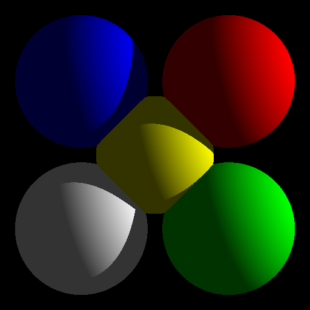

# RayTracing

Simple Ray Tracer

## Compile It

`make`

## Run It

`./RayTrace ./input/simple/input12.txt`

## About

A Phong reflection model is used for local illumination.  Shadows are present, although simple.  There is support for three primitive geometry types: triangles, spheres and ellpsoids.  If you would like to run the program on an entire directory:

`ls ./input/simple/*.txt | xargs -I {} ./RayTrace {}`

## Future Work

Support for other primitives:  Cone, Cylinder, Torus, etc.
Experiment with the bidirectional reflectance distribution function.
