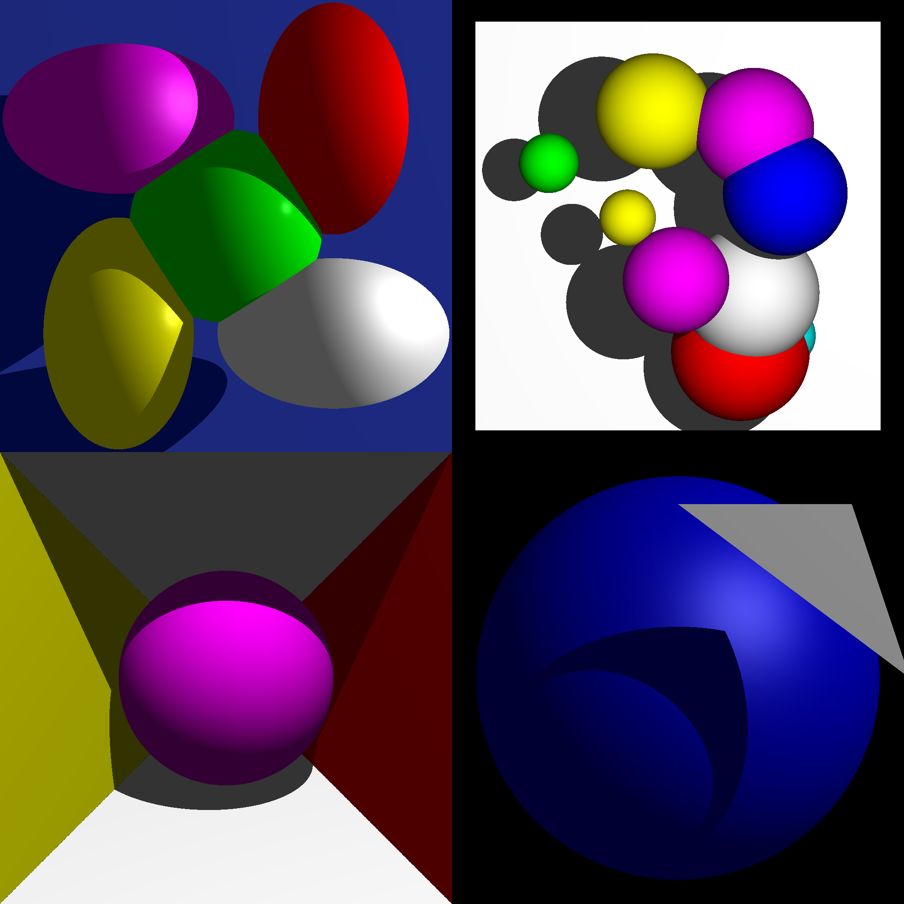

RayTracing
==========

Simple Ray Tracer

Compile It
----------

make

Run It
------

./RayTrace input.txt

Example:
./RayTrace ./inputdata/input2.txt

About
-----

Lighting and shadows are being rendered at this point.  If you would like to run the program on an entire directory:

ls ./input/simple/*.txt | xargs -I {} ./RayTrace {}
